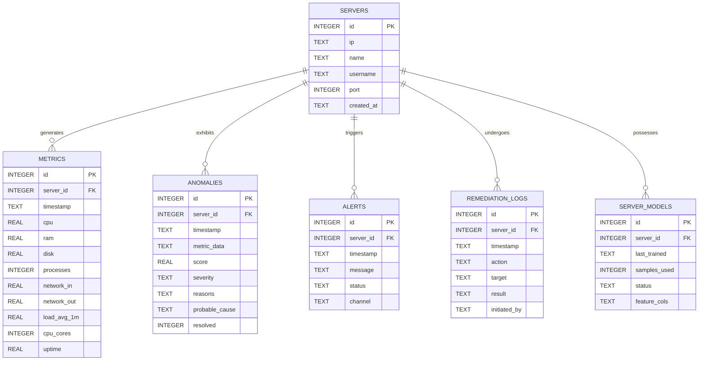
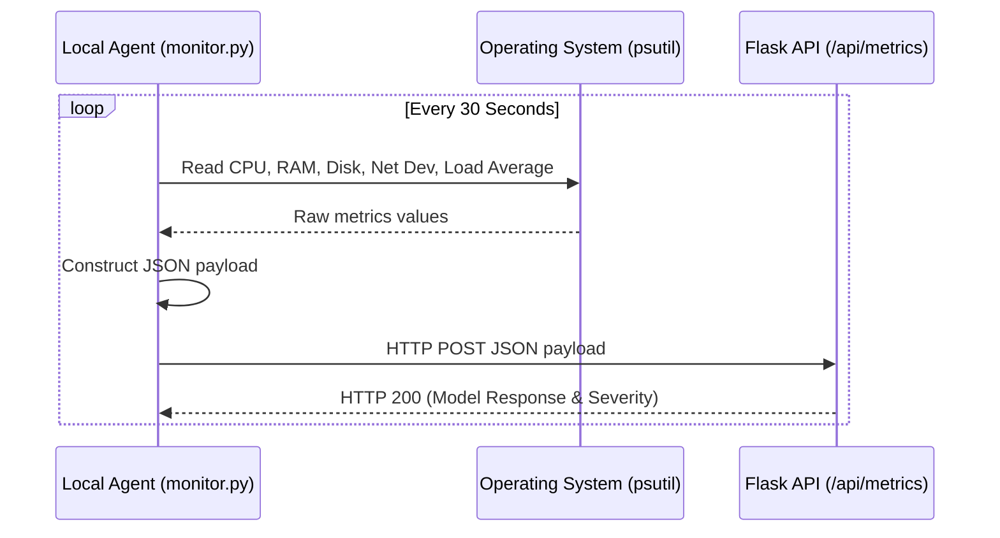
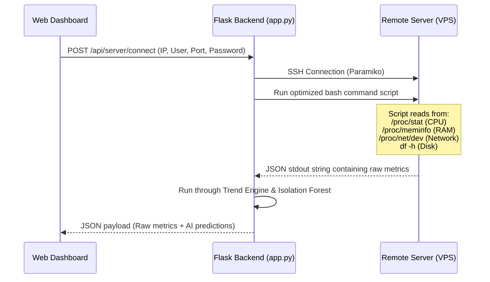

# 🧠 AIOps Monitoring Platform: System Architecture & Implementation Manual
## Project: Smart Cloud Pulse AI Monitor (AIOps Upgrade Edition)

This documentation provides an in-depth, end-to-end explanation of the **Smart Cloud Pulse AI Monitor** and its upgraded AIOps features. It covers the underlying machine learning logic, pipeline dynamics, database design, feature engineering, and implementation mechanics.

---

## 📌 1. System Overview & Technology Stack

The platform is designed to transition traditional threshold-based server monitoring into a **trend-aware, self-healing AIOps (Artificial Intelligence for IT Operations) system**. It combines real-time data ingestion, sliding-window temporal context, unsupervised machine learning, explainable heuristics, and noise-suppression gates.

### The Core Technology Stack

```
┌────────────────────────────────────────────────────────────────────────┐
│                        FRONTEND: DASHBOARD CARD                        │
│             HTML5 • Vanilla CSS (Premium Glassmorphism Style)           │
│                    Chart.js (Real-time visualizations)                 │
└───────────────────────────────────┬────────────────────────────────────┘
                                    │ WebSockets / HTTP
                                    ▼
┌────────────────────────────────────────────────────────────────────────┐
│                        BACKEND: FLASK WEB SERVER                       │
│      Flask (REST API Endpoints) • python-dotenv (Config management)     │
│        Paramiko (Agentless Remote VPS Monitoring via SSH)             │
└───────┬───────────────────────────┬────────────────────────────┬───────┘
        │ Read/Write                │ Run Pipeline               │ Read/Write
        ▼                           ▼                            ▼
┌──────────────────────┐    ┌──────────────────────┐    ┌──────────────────────┐
│   SQLITE DATABASE    │    │  MACHINE LEARNING    │    │     AIOPS ENGINES    │
│  WAL Mode enabled    │    │     scikit-learn     │    │  Trend / Explainer   │
│  anomaly_detection.db│    │   Isolation Forest   │    │  RootCause / Suppress│
└──────────────────────┘    └──────────────────────┘    └──────────────────────┘
```

*   **Frontend**: Built using HTML5, Vanilla CSS, and Vanilla Javascript. Data visualization is powered by **Chart.js** to render real-time, interactive CPU, memory, storage, process count, and network I/O charts.
*   **Backend**: A lightweight **Flask** REST API framework that coordinates metric ingestion, connects to remote hosts over SSH, invokes the machine learning pipeline, logs anomalies, and coordinates alerts.
*   **Database**: **SQLite** operating in Write-Ahead Logging (WAL) mode to permit concurrent reads and writes without thread blocking.
*   **Machine Learning**: **Scikit-Learn** (`sklearn`) is used for anomaly detection and preprocessing (`StandardScaler` and `IsolationForest`). Model states are serialized using **Joblib**.
*   **Agent (Local Monitor)**: A standalone Python script running in a loop, utilizing `psutil` to inspect physical device states and `requests` to POST JSON data.
*   **Remote VPS Collector (Agentless)**: **Paramiko** SSH client which runs a secure bash script on remote Linux systems to extract kernel parameters from `/proc/` files.

---

## 🔬 2. Anomaly Detection Logic & Mathematical Foundations

Unlike supervised classifiers (which require pre-labeled datasets of "healthy" vs "unhealthy" states), our platform runs an **unsupervised** pipeline because server failures are rare and highly unpredictable. We use the **Isolation Forest** algorithm to detect anomalies.

### Mathematical Foundations of the Isolation Forest

The fundamental premise of the Isolation Forest (i.F.) is: **anomalies are easier to isolate than normal observations.**

1.  **Binary Search Tree Representation**:
    Let $X = \{x_1, \dots, x_n\}$ be a dataset of $n$ instances in a $d$-dimensional space. An Isolation Tree (iTree) is constructed by recursively partitioning a subset of $X$ by randomly selecting a feature $q$ and a split value $p$ (between the minimum and maximum values of $q$ in the current node), until either:
    *   The tree reaches a maximum height limit.
    *   All data points in the node are identical.
    *   The size of the node becomes $1$.

2.  **Path Length $h(x)$**:
    The path length $h(x)$ of a point $x$ is the number of edges $x$ traverses from the root node of an iTree to a terminal leaf node. 
    As anomalies have distinct features, they partition easily and reside close to the root, resulting in small $h(x)$ values. Normal points cluster together, requiring many partitions, resulting in large $h(x)$ values.

3.  **Anomaly Score $s(x, n)$**:
    Since the maximum possible height of an iTree grows logarithmically with the number of samples $n$, path lengths are normalized. The average path length of an unsuccessful search in a Binary Search Tree (BST) is:
    $$c(n) = 2 \ln(n - 1) + 0.5772156649 \text{ (Euler's Constant)} - \frac{2(n - 1)}{n}$$
    
    The anomaly score $s$ for an instance $x$ over an ensemble of $m$ trees is formulated as:
    $$s(x, n) = 2^{-\frac{E(h(x))}{c(n)}}$$
    Where $E(h(x))$ is the expected (average) path length $h(x)$ across all $m$ trees in the forest.
    *   If $E(h(x)) \to 0$, then $s \to 2^0 = 1$. The point isolates quickly and is highly likely to be an **anomaly**.
    *   If $E(h(x)) \to c(n)$, then $s \to 2^{-1} = 0.5$. The point has an average path length similar to a random search and is likely **normal**.
    *   If $E(h(x)) \to n$, then $s \to 2^{-\infty} = 0$. The path lengths are long, meaning the point is deeply nested in a cluster and is **highly normal**.

In our implementation (`backend/model.py`), the decision function returns a standardized score where negative values represent anomalies. If the score is below the configured threshold (e.g. `THRESHOLD_HIGH = -0.75`), the pipeline flags an anomaly.

### Feature Engineering: "Distance-to-Danger"

To prevent false alarms during normal, low-utilization periods (where tiny changes like a CPU jump from 1% to 5% might look like an outlier), we transform utilization percentages using a **Distance-to-Danger** metric:

$$\text{CPU Distance-to-Danger} = 100.0 - \text{Current CPU Utilization}$$
$$\text{RAM Distance-to-Danger} = 100.0 - \text{Current RAM Utilization}$$

*   **How it helps**: A server operating in a safe state (e.g., 5% CPU, 10% RAM) produces large distance vectors (95, 90). These dense values form a tight cluster representing "normalcy". When a resource is exhausted (e.g., CPU spikes to 98%, distance drops to 2), the vector is pushed far from the normal cluster, making it easy for the Isolation Forest to isolate.

### Feature Pipeline Vector (16 Dimensions)

Every metric reading is preprocessed into a 16-dimensional vector before classification:

| Index | Feature Name | Formula / Source | Category |
|:---:|---|---|---|
| **1** | `cpu_distance_to_danger` | $100.0 - \text{cpu\_percent}$ | Core Engineered |
| **2** | `ram_distance_to_danger` | $100.0 - \text{ram\_percent}$ | Core Engineered |
| **3** | `disk` | Raw disk utilization % | Core Metric |
| **4** | `network_in` | Delta network bytes received per second | Core Metric |
| **5** | `network_out` | Delta network bytes sent per second | Core Metric |
| **6** | `processes` | Active system processes | Core Metric |
| **7** | `cpu_delta` | $CPU_t - CPU_{t-1}$ | Temporal Delta |
| **8** | `ram_delta` | $RAM_t - RAM_{t-1}$ | Temporal Delta |
| **9** | `disk_delta` | $Disk_t - Disk_{t-1}$ | Temporal Delta |
| **10** | `process_delta` | $Proc_t - Proc_{t-1}$ | Temporal Delta |
| **11** | `net_in_delta` | $NetIn_t - NetIn_{t-1}$ | Temporal Delta |
| **12** | `net_out_delta` | $NetOut_t - NetOut_{t-1}$ | Temporal Delta |
| **13** | `cpu_5min_avg` | $\frac{1}{N}\sum_{i=0}^{N-1} CPU_{t-i}$ | Rolling Window |
| **14** | `ram_5min_avg` | $\frac{1}{N}\sum_{i=0}^{N-1} RAM_{t-i}$ | Rolling Window |
| **15** | `net_in_5min_avg` | $\frac{1}{N}\sum_{i=0}^{N-1} NetIn_{t-i}$ | Rolling Window |
| **16** | `proc_5min_avg` | $\frac{1}{N}\sum_{i=0}^{N-1} Proc_{t-i}$ | Rolling Window |

*Note: For the rolling window average, $N=10$ (representing the last 10 polls over a 5-minute interval at 30-second poll rates).*

---

## 🗄️ 3. Database Architecture

The SQLite database (`backend/anomaly_detection.db`) is structured to support multiple monitored servers, track historical metrics, log anomalies with explaining reasons, manage alert dispatch states, and keep audit trails for automated self-healing scripts.



### Table Definitions & Column Roles

#### 1. `servers`
Tracks the servers connected to the monitoring platform.
*   `id`: Primary key.
*   `ip`, `name`, `username`, `port`: Remote SSH connection metadata.

#### 2. `metrics`
Stores raw resource usage reports.
*   `server_id`: Foreign key linking to the `servers` table (0 represents the local monitoring host).
*   `cpu`, `ram`, `disk`: Percentages.
*   `network_in`, `network_out`: Network rates in bytes per second.
*   `load_avg_1m`, `cpu_cores`: Operating system load characteristics used to compute load ratios.

#### 3. `anomalies`
Stores detected anomalous behavior.
*   `metric_data`: A JSON dump of the raw metrics that triggered the anomaly.
*   `score`: The Isolation Forest anomaly score.
*   `severity`: Classified as `Low`, `Medium`, or `High`.
*   `reasons`: A JSON-serialized array of strings explaining the cause of the anomaly (e.g., `["Critical CPU: 96%", "Rapid CPU spike: +30.2%"]`).
*   `probable_cause`: Categorized failure modes (e.g., `Possible Memory Leak`).
*   `resolved`: Boolean flag indicating if the issue was corrected.

#### 4. `alerts`
Tracks outbound alert notifications.
*   `channel`: Target transport channel (`console`, `telegram`, `email`, or `webhook`).
*   `status`: Tracked as `pending`, `sent`, or `failed` to support retry operations.

#### 5. `remediation_logs`
An audit trail for automated self-healing scripts.
*   `action`: Action taken (e.g. `service_restart`).
*   `target`: Target resource (e.g., `nginx`).
*   `result`: Output state (`success` or `failed`).
*   `initiated_by`: String indicating if the action was triggered by the `auto_remediator` or manual operator.

#### 6. `server_models`
Manages model training lifecycles for each server.
*   `last_trained`: Timestamp of the last training run.
*   `samples_used`: Total observations used during fitting.
*   `status`: Status of the model (`trained` or `needs_training`).
*   `feature_cols`: JSON representation of the features to catch configuration mismatches.

---

## ⚙️ 4. AIOps Engine Upgrade: Detailed Code Breakdown

The AIOps upgrade introduces four core engines that analyze raw metrics, generate explanations, classify root causes, and suppress duplicate notifications.

```
Incoming Metric
     │
     ▼
┌────────────────────────────────────────────────────────────────────────┐
│ 1. TREND ENGINE (backend/trend_engine.py)                               │
│    - Pushes reading into server-specific sliding window (10 samples)   │
│    - Calculates deltas (e.g., cpu_delta = current - previous)          │
│    - Calculates rolling averages (e.g., 5-min CPU average)            │
│    - Counts consecutive RAM increases (to detect memory leaks)        │
└────┬───────────────────────────────────────────────────────────────────┘
     │ enriched with trend features
     ▼
┌────────────────────────────────────────────────────────────────────────┐
│ 2. MODEL PIPELINE (backend/model.py & hybrid_pipeline.py)              │
│    - Normalizes 16 features using StandardScaler                       │
│    - Scores features via Isolation Forest                              │
│    - If score <= threshold, flags as Anomaly                           │
│    - Determines severity (Low, Medium, High)                           │
└────┬───────────────────────────────────────────────────────────────────┘
     │ if anomaly detected
     ▼
┌────────────────────────────────────────────────────────────────────────┐
│ 3. EXPLAINER ENGINE (backend/explainer.py)                              │
│    - Evaluates metrics/deltas against configurable thresholds         │
│    - Outputs bulleted reasons: e.g., ["Critical RAM: 96%", ...]       │
└────┬───────────────────────────────────────────────────────────────────┘
     │
     ▼
┌────────────────────────────────────────────────────────────────────────┐
│ 4. ROOT CAUSE CLASSIFIER (backend/root_cause.py)                       │
│    - Runs priority rules to find likely failure mode                   │
│    - Outputs: "Possible DDoS", "Possible Memory Leak", etc.            │
└────┬───────────────────────────────────────────────────────────────────┘
     │
     ▼
┌────────────────────────────────────────────────────────────────────────┐
│ 5. FALSE POSITIVE SUPPRESSOR (backend/false_positive_suppressor.py)    │
│    - Checks if anomaly persists for >= ALERT_CONSECUTIVE_MIN           │
│    - Enforces ALERT_COOLDOWN_MINUTES cooldown between alerts           │
│    - Prevents alert fatigue                                           │
└────┬───────────────────────────────────────────────────────────────────┘
     │ if suppression passes
     ▼
Alert Sent (Telegram, Email, Webhook)
```

### 1. The Trend Engine (`backend/trend_engine.py`)

Maintains an in-memory `deque(maxlen=10)` ring buffer for each server. It calculates:
*   **Deltas**: Difference between the current reading and the previous reading.
*   **Rolling Averages**: The average value of the last 10 polls.
*   **Memory Leak Detection**: Checks the number of consecutive polls where memory usage has steadily increased without dropping.

```python
class _TrendEngine:
    def __init__(self, window_size=10):
        self._bufs = {}  # Format: {server_id: deque}

    def push(self, server_id, metric):
        # Appends metric to the server's deque
        ...
    def get_features(self, server_id, current):
        # Calculates deltas and averages
        ...
    def consecutive_ram_increases(self, server_id):
        # Returns count of consecutive memory increases
        ...
```

### 2. The Explainer Engine (`backend/explainer.py`)

Translates raw numbers and trend vectors into human-readable bullet points. It compares features against the thresholds defined in `.env` to build a list of triggers.

```python
def explain(metric: dict, trend: dict, prediction: dict) -> list[str]:
    reasons = []
    # If CPU exceeds critical thresholds
    if cpu >= CPU_DANGER:
        reasons.append(f"Critical CPU: {cpu:.1f}%")
    # If CPU jumped rapidly
    if cpu_delta >= 25:
        reasons.append(f"Rapid CPU spike: +{cpu_delta:.1f}% since last reading")
    # If network inbound is abnormally high
    if net_in >= NET_SPIKE_DANGER:
        reasons.append(f"Extreme inbound: {net_in/1e6:.1f} MB/s — possible DDoS")
    ...
    return reasons
```

### 3. The Root Cause Classifier (`backend/root_cause.py`)

Uses a priority-based rule system to identify the most likely system issue.

```python
def classify_root_cause(metric: dict, trend: dict, consecutive_ram_increases: int) -> str:
    # 1. DDoS: CPU high + network inbound elevated
    if cpu >= CPU_HIGH and net_in_avg >= NET_SPIKE_MODERATE:
        return 'Possible DDoS / Traffic Overload'
        
    # 2. Memory Leak: steady RAM increases over 5+ polls
    if consecutive_ram_increases >= 5 and ram_delta > 0:
        return 'Possible Memory Leak'
        
    # 3. Service Crash: rapid drop in process count
    if process_delta <= -PROCESS_DROP_HIGH:
        return 'Possible Service Crash'
        
    # Default fallback
    return 'Abnormal System Behavior'
```

### 4. The False Positive Suppressor (`backend/false_positive_suppressor.py`)

Implements a two-gate check to prevent alert fatigue (flooding administrators with notifications):
*   **Consecutive Poll Gate**: Ensures an anomaly is persistent (lasts for at least $N$ polls) before triggering an alert.
*   **Cooldown Gate**: Prevents repeat alerts for the same server within a set time window.

---

## 🔌 5. Monitoring Agents: Mechanics & Flow

### The Local Agent (`agent/monitor.py`)

The local agent is a lightweight background script that collects and transmits metrics using `psutil`.



*   **Load Ratio Calculation**: 
    $$\text{Load Ratio} = \frac{\text{System Load Average (1-minute)}}{\text{CPU Core Count}}$$
    A load ratio $> 1.0$ indicates CPU queue congestion.

---

### The Remote Agentless Collector (SSH Engine)

To monitor a remote server without installing software on it, the backend establishes a secure SSH connection and runs a script to gather metrics.



The script runs a single shell command to extract system metrics and return them as a JSON string:

```bash
# Read memory metrics
read total free avail < <(awk '/MemTotal/ {t=$2} /MemFree/ {f=$2} /MemAvailable/ {a=$2} END {print t, f, a}' /proc/meminfo)
# Read CPU counters
read cpu_user cpu_nice cpu_sys cpu_idle < <(awk '/^cpu / {print $2, $3, $4, $5}' /proc/stat)
```
This data is processed by the Flask backend and passed to the web dashboard.

---

## 🛠️ 6. Setup & Operations Guide

### Initial Run & Verification

Follow these steps to initialize the database and run the system.

1.  **Initialize/Migrate Database**:
    Run this python command to create the schema and verify migrations:
    ```bash
    python -c "from backend.database import init_db; init_db()"
    ```
2.  **Start the API Backend**:
    ```bash
    python -m backend.app
    ```
3.  **Run the Local Monitor Agent**:
    ```bash
    python agent/monitor.py
    ```

### How the Model Trains and Updates

1.  **Warm-up Phase**:
    When a server is added, it must collect a baseline of normal metric readings (configured by `MODEL_TRAIN_SAMPLES`, defaulting to `20` polls). While in this phase, the dashboard displays a `Model Status: Warm-up` badge, and predictions default to `Normal`.
2.  **Fitting Phase**:
    Once the metric threshold is met, the system triggers the training pipeline:
    *   Retrieves historical metrics from the database.
    *   Generates corresponding trend features.
    *   Fits the `StandardScaler` to normalize features:
        $$z = \frac{x - \mu}{\sigma}$$
    *   Fits the `IsolationForest` to establish the baseline:
        ```python
        model = IsolationForest(contamination=0.02, random_state=42)
        model.fit(scaled_features)
        ```
    *   Saves the fitted model and scaler as `.joblib` files.
3.  **Auto-Retraining Phase**:
    Every night (or after a set number of new metrics are logged), the backend triggers a retrain command to ensure the model adapts to gradual changes in server behavior.

---

## 📊 7. Visualizing the Glassmorphism Dashboard

The dashboard uses a dark-mode **glassmorphism** design. Glassmorphism combines transparency, blur, and subtle borders to create a premium user interface.

```css
.card {
    background: rgba(255, 255, 255, 0.05);
    backdrop-filter: blur(12px);
    border: 1px solid rgba(255, 255, 255, 0.1);
    border-radius: 16px;
    box-shadow: 0 8px 32px 0 rgba(0, 0, 0, 0.37);
}
```

### Anomaly Explanation & Root-Cause UI

When the AI flags an anomaly, the dashboard displays explaining reasons and probable causes:

```
┌──────────────────────────────────────────────────────────┐
│  ⚠️ DANGER ANOMALY DETECTED                               │
├──────────────────────────────────────────────────────────┤
│  Likely Cause: Possible DDoS / Traffic Overload          │
│                                                          │
│  Triggered Reasons:                                      │
│  • High CPU: 89.4%                                       │
│  • Rapid CPU spike: +32.1% since last reading            │
│  • Extreme inbound: 12.4 MB/s                            │
│                                                          │
│  [Remediation Executed: Restarting nginx ... SUCCESS]    │
└──────────────────────────────────────────────────────────┘
```

The interface highlights anomalies using soft color palettes (like crimson and amber) and smooth CSS transitions.

---

## 💡 8. Troubleshooting & FAQ

*   **Why is Model Status showing "Warm-up"?**
    The Isolation Forest requires baseline historical data to detect anomalies. The server needs to collect at least 20 polls (`MODEL_TRAIN_SAMPLES`) before training the model.
*   **What happens if I change the number of features in the configuration?**
    The system automatically detects feature count changes when loading existing models. If a mismatch is found, it safely discards the old model and triggers a retrain run.
*   **Will monitoring a remote server slow down the dashboard?**
    No. Paramiko SSH queries and metric analysis are run asynchronously on background threads, preventing web browser lag or backend blocking.
