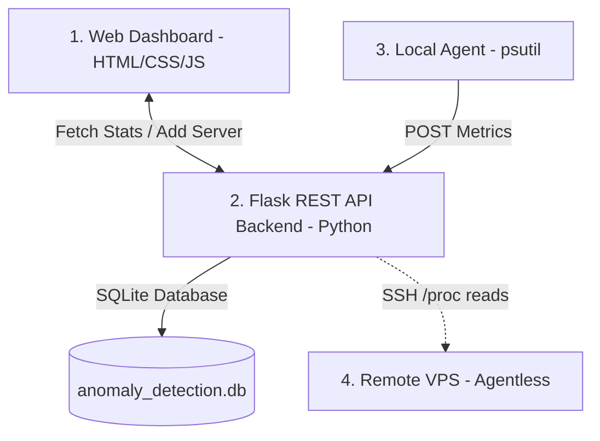

# 🚀 Beginner's Guide to Smart Cloud Pulse AI Monitor

Welcome to the **Smart Cloud Pulse AI Monitor**! This guide is designed to help you understand what this project is, how it detects anomalies under the hood using Machine Learning (AI), and how the codebase is structured.

---

## 📌 Project Overview
The **Smart Cloud Pulse AI Monitor** is a real-time, AI-powered system resource monitoring and anomaly detection application. It tracks vital system health indicators (CPU, RAM, Disk, Processes, Network traffic) and alerts administrators when a server behaves abnormally (such as service crashes, traffic spikes, resource leaks, or cyber attacks).

### Key Features
1. **Real-time Local Agent**: Collects metrics from the machine it runs on and sends them to the API.
2. **Agentless Remote Monitoring (SSH)**: Add multiple remote Linux servers (VPS) and poll metrics securely over SSH using just a transient password (never stored).
3. **AI Anomaly Detection**: Uses an **Isolation Forest** machine learning model to study server behavior and detect outlier conditions.
4. **Hybrid Detection Engine**: Combines fixed hardware thresholds (Danger/Warning limits) with AI scores for a double-layer safety system.
5. **Glassmorphism Dashboard**: A dark-mode web dashboard showing live-updating charts, system status badges, anomaly logs, and server management selectors.

---

## 🏗️ System Architecture
The application consists of three main components:



### 1. The Local Monitor Agent (`agent/monitor.py`)
A lightweight script that runs in the background on the server you want to monitor. It:
* Uses the `psutil` library to read current system metrics (CPU %, RAM %, Disk %, active processes, network bytes read/written, and system uptime).
* Posts this data as a JSON payload to the REST API every 30 seconds.

### 2. The REST API Backend (`backend/app.py` & `backend/database.py`)
Built with **Flask** and **SQLite**, the backend acts as the central coordinator:
* **Database**: Keeps history of all incoming metrics, alerts, detected anomalies, and saved remote server connections in `anomaly_detection.db`.
* **Retraining**: Automates model retraining when a server gathers enough data.
* **Endpoints**:
  * `POST /api/metrics` — Receives metrics from the local agent, scores them using the AI, and logs anomalies/alerts.
  * `GET /api/status` — Returns the model health, features used, and current state.
  * `POST /api/server/connect` — SSHs into a saved remote VPS using a password, executes a metrics-gathering script, and scores the result.

### 3. The Dashboard Frontend (`dashboard/`)
A responsive, single-page application built with HTML, CSS, and Vanilla JavaScript. It uses:
* **Chart.js** to render real-time charts (CPU, RAM, Disk, processes, network speed).
* A dynamic list of saved remote servers with a password-prompt connection gateway.
* Visual indicators (flashing red animations) when anomalies or danger states are detected.

---

## 🧠 The AI Model Explained (Simply!)

### 1. What is an Anomaly?
In server monitoring, an anomaly is any behavior that deviates significantly from normal patterns. For example:
* **Normal**: CPU usage oscillates between 5% and 40%, process count is stable around 150.
* **Anomaly**: CPU drops to 0.1% and processes drop to 30 (web server crash), or CPU spikes to 99% with a massive incoming network rate (DDoS attack).

### 2. What is an Isolation Forest?
We use the **Isolation Forest** (`sklearn.ensemble.IsolationForest`) algorithm. 
* **The Concept**: Instead of profiling "normal" points, it isolates anomalies. It does this by randomly picking a feature (like CPU) and then randomly selecting a split value between the minimum and maximum.
* **Why it works**: Anomalous points are statistically sparse and far away from normal dense clusters. Therefore, they require **very few splits** to isolate.
  * Scores close to **`0.0`** or positive numbers indicate dense clusters (**Normal**).
  * Negative scores indicate rare states (**Anomaly**). The app maps these into three severity tiers: **`Moderate Anomaly`** (score $\le -0.55$), **`High Anomaly`** (score $\le -0.70$), and **`Danger`** (score $\le -0.85$).

### 3. Feature Engineering: "Distance to Danger"
If you feed raw percentages (0% to 100%) to the Isolation Forest, minor fluctuations (e.g. CPU jumping from 2% to 12%) might look like anomalies because they are sparse. To fix this, we engineer **Relative Distance to Danger** metrics:
$$\text{CPU Distance to Danger} = 100.0 - \text{Current CPU}$$
$$\text{RAM Distance to Danger} = 100.0 - \text{Current RAM}$$

* **How it helps**: Safe, idle states produce large values (near 100) that form dense, clustered points. The model learns that high distances are normal. As the server approaches capacity (distance goes to 0), it becomes highly isolated in the feature space and is immediately flagged.

---

## 🔒 How Remote VPS Monitoring Works (SSH)

To monitor a remote VPS, we use an **agentless approach** so you don't have to install any Python scripts or tools on that server.

```
[Dashboard] ──(Click Remote VPS + Enter Password)──> [Flask API]
                                                         │
                                                     (Paramiko SSH Connect)
                                                         │
                                                         ▼
                                               [Runs Bash Script]
                                                         │
                                             (Reads /proc/stat, etc.)
                                                         │
                                                         ▼
[Updates Charts] <──(JSON Metrics + AI Score)─── [Flask API]
```

1. You click on a saved VPS and enter the password in the dashboard.
2. The browser sends the request to the Flask server via `POST /api/server/connect`.
3. The backend opens a secure SSH connection to the remote machine using `paramiko`.
4. It executes a lightweight, optimized bash script directly on the remote system:
   * **CPU**: Calculated from `/proc/stat` delta counters.
   * **RAM**: Extracted from `/proc/meminfo`.
   * **Disk**: Read using `df`.
   * **Network**: Read from `/proc/net/dev` (returns total bytes received/sent).
5. The script outputs a single JSON string back to Flask.
6. Flask closes the SSH connection, runs the JSON metrics through the Isolation Forest, calculates the network rates from successive polls, and returns it to your browser.
7. **The password is never written to a database or disk; it exists only in browser-side memory during active monitoring.**

---

## 🛠️ Step-by-Step Installation & Run Guide

Follow these steps to set up and run the project on a new PC:

### Step 1: Clone the Repository
```bash
git clone https://github.com/Pratikraj1089/ai_based_cloud_anomoly_detection_system.git
cd ai_based_cloud_anomoly_detection_system
```

### Step 2: Set Up Python 3.13 Virtual Environment
Rebuilding the environment with Python 3.13 ensures pre-compiled binary packages are downloaded without compiling from source:
```bash
# Remove any broken environment
rm -rf venv

# Create a fresh Python 3.13 virtual environment
python3.13 -m venv venv

# Activate it
source venv/bin/activate
```

### Step 3: Install Dependencies
```bash
pip install --upgrade pip
pip install -r requirements.txt
```

### Step 4: Configure Settings
Create a configuration file from the template:
```bash
cp .env.example .env
```
*(You can edit `.env` to change thresholds or add SMTP settings for email alerts).*

### Step 5: Start the Backend API
Make sure you run the app from the **project root** directory:
```bash
source venv/bin/activate
python -m backend.app
```
*The API is now running on `http://localhost:5000`.*

### Step 6: Start the Metrics Collection Agent
In a **new terminal tab/window**, start the local metrics agent:
```bash
cd ai_based_cloud_anomoly_detection_system
source venv/bin/activate
python agent/monitor.py
```

### Step 7: View the Dashboard
Open your web browser and navigate to:
👉 **[http://localhost:5000](http://localhost:5000)**

---

## 📁 Code Directory Map
Here is where the files live:

* 📁 `agent/`
  * 📄 `monitor.py` — Script running on servers to collect metrics and POST them to Flask.
* 📁 `backend/`
  * 📄 `app.py` — Flask server containing routes and SSH controller logic.
  * 📄 `database.py` — SQLite schema definitions and CRUD queries.
  * 📄 `model.py` — Isolation Forest model container (training, scoring, prediction).
  * 📄 `hybrid_pipeline.py` — High-level feature engineering and threshold classifications.
  * 📄 `alerts.py` — Handles alerting channels (Console/Email/Slack).
* 📁 `dashboard/`
  * 📄 `index.html` — The main frontend layout structure.
  * 📄 `style.css` — High-fidelity dark mode style definitions.
  * 📄 `app.js` — Frontend runtime controller (Chart rendering, connection manager, API client).
* 📄 `config.py` — Load environment variables and configure base application constants.
* 📄 `requirements.txt` — List of required Python packages.
